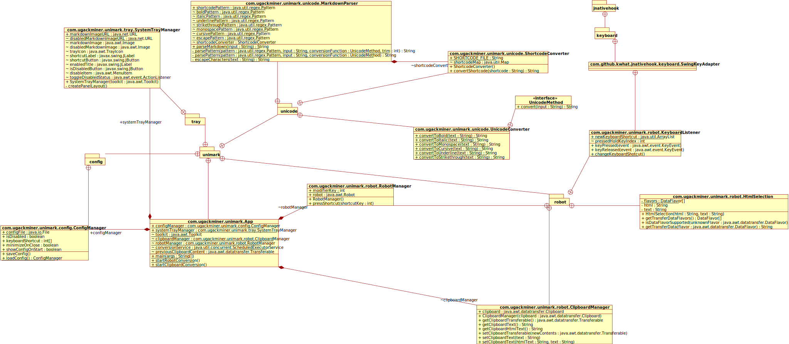
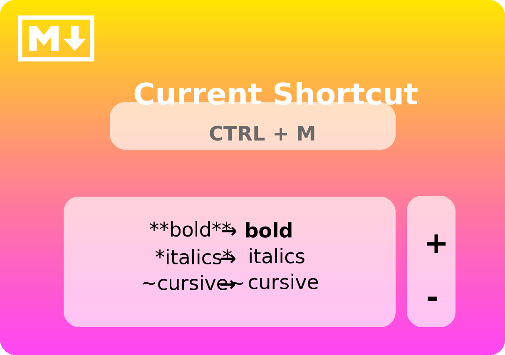
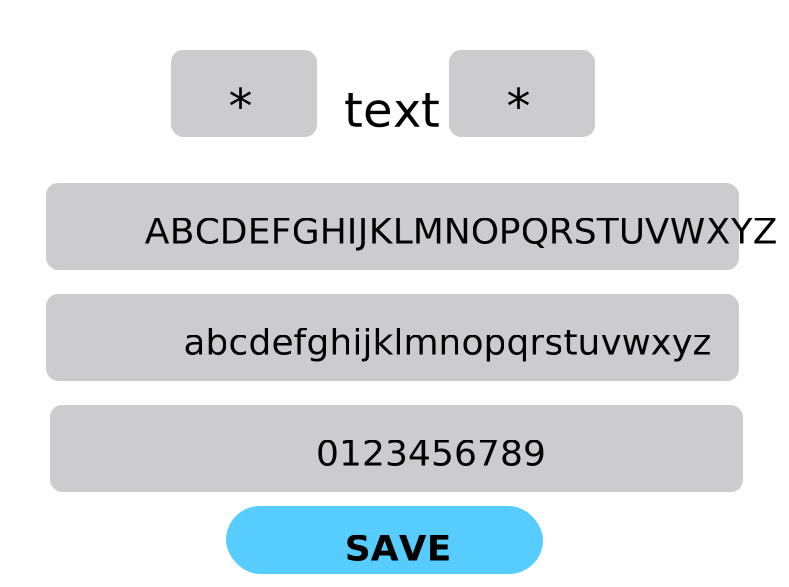
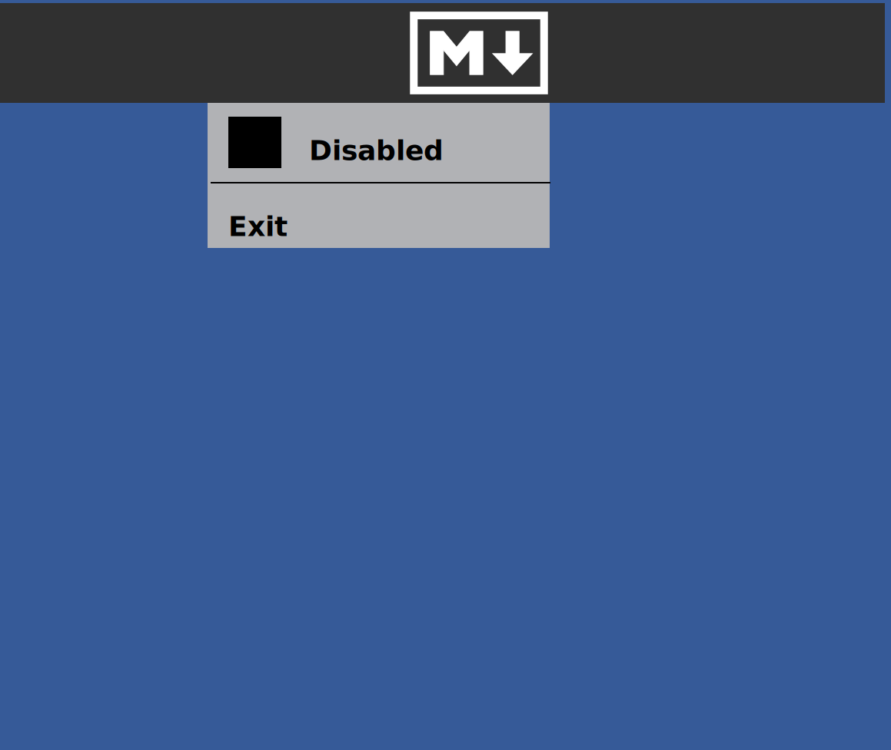

# Criterion B

## Execution Flow (Rough Sketch)
![Rough Sketch of the execution flow of the program. It starts at a trigger source, before moving execution to the Robot, which sends Ctrl+C to the keyboard. The keyboard then copies text onto the clipboard, which is read by the ClipboardManager. The text then passes through the Parser, and the parsed text goes into a Converter. The Converter then sends back the formatted text, which is passed all the way back to the ClipboardManager and gets written back onto the clipboard. At the same time, the Robot sends Ctrl+V to the keyboard, pasting the text back into wherever it came from.](./resources/Rough-Sketch.svg)

## UML Class Diagram

## App Mockup
  
  

## Appendix Items:
[Record of Tasks](./appendix/Record-Of-Tasks.md)