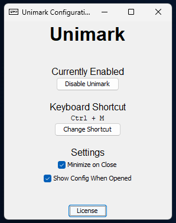

# Criterion C: Development

## Techniques Used
- Arrays
- User-defined Objects
- Simple Selection
- Complex Selection
- Loops
- Nested Loops (in the build script when reversing shortcodes)
- User-defined Methods
- User-defined Methods with parameters
- User-defined Methods with appropriate return values
- Exit Flag
- Used List ADT (via ArrayList)
- Saving to a file
- Reading and parsing a file
- GUI Popup Menus
- External Libraries (`jnativehook`, `Moshi`, `Shadow`, `Swing`, `AWT`)

## Getting User Input
### Global Keybind
Because user input can usually only be read if the app is in focus (in Java), the program needed a special way to read global user input.

This was done using the `jnativehook` library, which provides a way to "hook" into the keyboard in a way that works when other apps are focused.

<!-- KeybnoardListener.java as of commit 289fa5ab5349746ebbfca40dc3a9bc67854ec90f -->
```java
if (event.getKeyCode() == NativeKeyEvent.VC_CONTROL) {
    ctrlKeyPressed = true;
} else if (ctrlKeyPressed && event.getKeyCode() == NativeKeyEvent.VC_M) {
    try {
        App.startRobotConversion();
        ctrlKeyPressed = false;
    } catch (Exception err) {
        System.err.println("There was an error!");
        System.err.println(err.toString());
    }
}
```

This was later changed to work with custom keybinds, which looks like the following snippet.

<!-- KeyboardListener.java as of latest commit -->
```java
if (event.getKeyCode() == App.configManager.keyboardShortcut[pressedHoldKeyIndex]) {
    pressedHoldKeyIndex++;
} else {
    pressedHoldKeyIndex = 0;
}

if (pressedHoldKeyIndex == App.configManager.keyboardShortcut.length) {
    try {
        App.startRobotConversion();
        pressedHoldKeyIndex = 0;
    } catch (Exception err) {
        System.err.println("There was an error!");
        System.err.println(err.toString());
    }
}
```

### Reading Text from Other Apps
The program needs to be able to read text from other apps in order for that text to be converted, something that is usually disallowed in operating systems because of security concerns.

In order to keep the security of the system intact, I used Java AWT's `Robot` class in order to send keypresses that would trigger clipboard actions in the other apps (<kbd>CTRL</kbd>+<kbd>X</kbd>).

<!-- RobotManager.java as of latest commit -->
```java
public void pressShortcut(int shortcutKey) {
    robot.keyPress(modifierKey);
    robot.keyPress(shortcutKey);
    robot.keyRelease(shortcutKey);
    robot.keyRelease(modifierKey);
    
    robot.delay(100);
}
```
<!-- App.java as of latest commit -->
```java
robotManager.pressShortcut(KeyEvent.VK_A);
robotManager.pressShortcut(KeyEvent.VK_X);
```

I was then able to (using the AWT `Clipboard` class and MadProgrammer's [HTMLSelection Class](https://stackoverflow.com/questions/71550362/how-to-copy-text-html-and-text-plain-to-clipboard-using-java) licensed under CC-BY-SA 4.0) read the contents of the clipboard and start the conversion process.

<!-- ClipboardManager.java as of latest commit -->
```java
public String getClipboardText() {
    try {
        return (String)this.getClipboardTransferable().getTransferData(DataFlavor.stringFlavor);
    } catch (Exception err) {
        return null;
    }
}
```

<!-- App.java as of latest commit -->
```java
String clipboardText = clipboardManager.getClipboardText();
String clipboardHtml = clipboardManager.getClipboardHtmlText();
```

The program also makes a backup of the user's clipboard before this process starts, which will be important in a moment.

<!-- App.java as of latest commit -->
```java
App.previousClipboardContent = clipboardManager.getClipboardTransferable();
```

<!-- GIF or image of program flow here -->

### Placing Text into Other Apps
Once the conversion was finished, the same process was done in reverse in order to send the converted text back into the other program.

The user's clipboard contents are also restored from the backup, so that they don't lose any information that may have been stored on the clipboard!

<!-- App.java as of latest commit -->
```java
robotManager.pressShortcut(KeyEvent.VK_V);
conversionService.schedule(() -> {
    clipboardManager.setClipboardTransferable(App.previousClipboardContent);
}, 100, TimeUnit.MILLISECONDS);
```

<!-- GIF or image of program flow here -->

## Parsing & Converting Text
### Parsing Markdown
One of the two fundamental parts of the program, it was important to write a markdown parsing algorithm in a way that would be easily extensible and robust in order to avoid any issues.

This was accomplished by having a java `Pattern` for each one of the different conversion types.

<!-- MarkdownParser.java as of latest commit -->
```java
static final Pattern shortcodePattern = Pattern.compile("(?<!\\\\):.*?[^\\\\]:");
static final Pattern boldPattern = Pattern.compile("(?<!\\\\)\\*\\*.*?[^\\\\]\\*\\*");
static final Pattern italicPattern = Pattern.compile("(?<!\\\\)\\*.*?[^\\\\]\\*");
static final Pattern underlinePattern = Pattern.compile("(?<!\\\\)__.*?[^\\\\]__");
static final Pattern strikethroughPattern = Pattern.compile("(?<!\\\\)~~.*?[^\\\\]~~");
static final Pattern monospacePattern = Pattern.compile("(?<!\\\\)`.*?[^\\\\]`");
static final Pattern cursivePattern = Pattern.compile("(?<!\\\\)~.*?[^\\\\]~");
static final Pattern escapePattern = Pattern.compile("\\\\\\S");
```

These patterns were then run through a function that would separate out all matches of the regex and run them through the appropriate Unicode conversion function (specified in the parameters).

<!-- MarkdownParser.java as of latest commit -->
```java
/**
 * A function that takes in a String and a Regex and outputs the function applied to all matches.
 * Meant to be used to run a Unicode convertor on each Markdown match.
 * 
 * @param pattern The Regex pattern that the function tries to parse
 * @param input The input string that the function parses
 * @param conversionFunction The function that takes in matched patterns and converts them to special Unicode characters 
 * @param trim The number of characters to trim from the beginning and end of the string
 * @return A new String with the outputs of the conversionFunction applied to each 
 */
private static String parsePattern(Pattern pattern, String input, UnicodeMethod conversionFunction, int trim) {
    Matcher matcher = pattern.matcher(input);
    StringBuffer result = new StringBuffer(input.length());

    while (matcher.find()) {
        matcher.appendReplacement(result, "");
        result.append(conversionFunction.convert(matcher.group(0).substring(trim, matcher.group(0).length() - trim)));
    }
    matcher.appendTail(result);
    return result.toString();
}
```


### Converting Markdown to Unicode  
The other fundamental part of the program, the Unicode conversion, was done in two separate ways for the two different types of text conversion.

The first method uses a specified offset that is added to each compatible character in order to get it into the correct Unicode range.

<!-- UnicodeConverter.java as of latest commit -->
```java
/**
 * Takes in a String and converts all letters
 * to be in the {@code MATHEMATICAL MONOSPACE} Unicode range ({@code U+1D670}/{@code U+1D7F6})
 * @param text The input String
 * @return The monospaced version of the String
 */    
public static String convertToMonospace(String text) {
    StringBuilder builder = new StringBuilder(text.length());

    for (char character : text.toCharArray()) {
        if (Character.isAlphabetic(character)) {
            builder.append(Character.toChars(character + (0x1D629 + (Character.isUpperCase(character) ? 6 : 0)))); // 1D62F uppercase vs 1D629 lowercase
        } else if (Character.isDigit(character)) {
            builder.append(Character.toChars(character + 0x1D7C6));
        } else {
            builder.append(character);
        }
    }

    return builder.toString();
}
```

In some cases, more processing and offsets are needed in order to support more Unicode characters.

<!-- UnicodeConverter.java as of latest commit -->
```java
/**
 * Takes in a String and converts all alphanumeric characters 
 * to be in the {@code MATHEMATICAL BOLD SANS-SERIF} Unicode range ({@code U+1D622}/{@code U+1D6E2}).
 * @param text The input String
 * @return The bolded version of the String
 */
public static String convertToBold(String text) {
    StringBuilder builder = new StringBuilder(text.length());
    char[] characters = text.toCharArray();
    int characterCode;        

    for (int i=0; i<characters.length; i++) {
        if (Character.isAlphabetic(characters[i])) {
            builder.append(Character.toChars(characters[i] + (0x1D58D + (Character.isUpperCase(characters[i]) ? 6 : 0))));
        } else if (Character.isDigit(characters[i])) {
            builder.append(Character.toChars(characters[i] + 0x1D7BC));
        } else if (((characterCode = text.codePointAt(i)) != 0) && (characterCode >= 0x1D608 && characterCode <= 0x1D63B)) { 
            // If the integer chars at i in the string are between italic A and italic z then make it bold+italics
            builder.append(Character.toChars(characterCode + 0x34));
            i += Character.charCount(characterCode)-1;
        } else {
            builder.append(characters[i]);
        }
    }

    return builder.toString();
}
```

This process works for all of the conversion functions that actually change each character. However, some of them instead place a special character *after* each other character in order to merge it with the one before.

<!-- UnicodeConverter.java as of latest commit -->
```java
/**
 * Takes in a string and puts {@code U+035F} after every character 
 * in order to make an underlined String.
 * @param text The input String
 * @return The underlined version of the String
 */
public static String convertToUnderline(String text) {
    StringBuilder builder = new StringBuilder(text.length()*3);

    for (int i = 0; i < text.length();) {
        int character = text.codePointAt(i);
        builder.append(Character.toChars(character));
        builder.append("\u035F");
        i += Character.charCount(character);
    }
    return builder.toString();
}
```

Note the extra logic that goes into handling inputs where one unicode character (like an emoji) is actually represented as multiple chars, something that I didn’t initially implement and led to many frustrating headaches.

<!-- Image of old convertToUnderline -->
```java
public static String convertToUnderline(String text) {
    StringBuilder builder = new StringBuilder(text.length()*2);

    for (char character : text.toCharArray()) {
        builder.append(character);
        builder.append("\u035F");
    }
    return builder.toString();
}
```


<!-- GIF of broken conversion -->

### Converting shortcodes to emoji
Converting shortcodes to emoji was done using the [Emojibase](https://emojibase.dev/) dataset, which has a list of common shortcodes and the Unicode characters they map to.

Downloading the dataset from their GitHub showed a problem though. By default, the dataset supplies the shortcodes of the characters, not the characters of the shortcodes!

<!-- Default emojibase.raw.json from https://raw.githubusercontent.com/milesj/emojibase/master/packages/data/en/shortcodes/emojibase.raw.json on 1/23/2024 -->
```json
"2049": [
    "exclamation_question",
    "interrobang"
],
"2122": [
    "tm",
    "trade_mark"
],
"2139": [
    "info",
    "information_source"
],
"2194": "left_right_arrow",
```

Since I was planning to use a `Map`, these needed to be reversed, which I was able to do easily in JavaScript.

<!-- reverseShortcodes.js as of commit 2b2a5c2f282808c052a9d0ab0386eefed15ae93a -->
```js
const shortcodes = {};

let outputObject = {};
for (let [key, value] of Object.entries(shortcodes)) {
    if (typeof value != "string") {
        value.forEach((arrValue) => {
            outputObject[arrValue] = key;
        });
    } else {
        outputObject[value] = key;
    }
}
```

<!-- shortcodes.json as of commit 2b2a5c2f282808c052a9d0ab0386eefed15ae93a -->
```json
"100": "1F4AF",
"1234": "1F522",
"exclamation_question": "2049",
"interrobang": "2049",
"tm": "2122",
"trade_mark": "2122",
"info": "2139",
"information_source": "2139",
"left_right_arrow": "2194",
"arrow_up_down": "2195",
"arrow_upper_left": "2196",
"arrow_upper_right": "2197",
"arrow_lower_right": "2198",
"arrow_lower_left": "2199",
"keyboard": "2328",
```

However, this approach would only work one time, and I wanted the shortcode list to be updated whenever the program was compiled.
To do this, I rewrote the reverser in Kotlin and added it to the gradle build script.

<!-- build.gradle.kts as of latest commit -->
```kotlin
val shortcodes = JsonSlurper().parseText(response.body()) as Map<String, Any>
val reversedShortcodes = mutableMapOf<String, String>()

shortcodes.forEach { (key, value) ->
    if (value is ArrayList<*>) {
        for (singleValue in value) {
            reversedShortcodes[singleValue as String] = key
        }
    } else {
        reversedShortcodes[value as String] = key
    }
}
```

I also made the build script automatically download the latest shortcode list if missing, so that I didn't have to include the shortcodes in the version history.

<!-- build.gradle.kts as of latest commit -->
```kotlin
val resourcesDir = sourceSets.main.get().getResources().getSrcDirs().iterator().next();
val sourceUrl = "https://raw.githubusercontent.com/milesj/emojibase/master/packages/data/en/shortcodes/emojibase.raw.json"

val client = HttpClient.newBuilder().build();
val request = HttpRequest.newBuilder().uri(URI.create(sourceUrl)).build();

val response = client.send(request, HttpResponse.BodyHandlers.ofString());
```

## GUI Techniques
### Minimizing to system tray
To minimize the app to the system tray, I had to create a simple Java `Swing` GUI, which I then setup with the following settings.

<!-- SystemTrayManager.java as of latest commit -->
```java
setTitle("Unimark Configuration Window");
setSize(300, 375);
setDefaultCloseOperation(App.configManager.minimizeOnClose ? WindowConstants.HIDE_ON_CLOSE : WindowConstants.DISPOSE_ON_CLOSE);

addWindowListener(this);
setIconImage(markdownImage);
setVisible(App.configManager.showConfigOnStart);
```

I was then able to build a GUI by initializing some simple Swing objects.

<!-- SystemTrayManager.java as of latest commit -->
```java
// Create the enabled panel
JPanel enabledPanel = new JPanel();
enabledPanel.setLayout(new BoxLayout(enabledPanel, BoxLayout.Y_AXIS));
enabledPanel.setAlignmentY(CENTER_ALIGNMENT);
enabledPanel.setBorder(new EmptyBorder(32, 0, 0, 0));
mainPanel.add(enabledPanel);

enabledTitle = new JLabel();
enabledTitle.setAlignmentX(Component.CENTER_ALIGNMENT);
enabledTitle.setFont(new Font("Sans-Serif", Font.PLAIN, 16));
enabledPanel.add(enabledTitle);

isDisabledButton = new JButton();
isDisabledButton.setAlignmentX(Component.CENTER_ALIGNMENT);
isDisabledButton.addActionListener(toggleDisabledStatus);
enabledPanel.add(isDisabledButton);
```

<!-- Program GUI as of latest commit -->


### Saving config options
Saving these config options required a way to read and write them to a file in a human-readable way, so that they could be edited without the program open.

<!-- ConfigManager.java as of latest commit -->
```java
public boolean isDisabled = false;
public int[] keyboardShortcut = {RobotManager.modifierKey, KeyEvent.VK_M};
public boolean minimizeOnClose = true;
public boolean showConfigOnStart = true;
```

I decided on using `Moshi`, a JSON parser and creator in order to convert the config vars into a JSON file.

<!-- ConfigManager.java as of latest commit -->
```java
public void saveConfig() {
    try {
        configFile.createNewFile();
        Moshi moshi = new Moshi.Builder().build();
        JsonAdapter<ConfigManager> adapter = moshi.adapter(ConfigManager.class);
        JsonWriter writer = JsonWriter.of(Okio.buffer(Okio.sink(configFile)));

        adapter.toJson(writer, this);
        writer.close();
    } catch (IOException ex) {
        System.err.println(ex);
    }
}
```

<!-- Default unimark-config.json file as of latest commit -->
```json
{"isDisabled":false,"keyboardShortcut":[17,77],"minimizeOnClose":true,"showConfigOnStart":true}
```

## Building Techniques
### Using shadow to make a fat jar
Because I didn't want users to have to download and extract a zip, (and because the client wanted to easily run the program), I used the `Shadow` library in order to compile the whole project into a "fat" jar.

<!-- build.gradle.kts as of latest commit -->
```kotlin
plugins {
    // Apply the application plugin to add support for building a CLI application in Java.
    application
    id("com.github.johnrengelman.shadow") version "8.1.1"
}
```

<!-- Result of running ./gradlew shadowJar as of latest commit-->
```
$ ./gradlew shadowJar

BUILD SUCCESSFUL in 960ms
3 actionable tasks: 3 up-to-date
```

### Unit testing
To make sure that different parts of the program still worked correctly, I used the JUnit `Assertions` api in order to test that the output of the program was the same as what I expected.

<!-- UnicodeConverterTest.java as of latest commit -->
```java
static final String UPPERCASE_STRING = "ABCDEFGHIJKLMNOPQRSTUVWXYZ";
static final String LOWERCASE_STRING = "abcdefghijklmnopqrstuvwxyz";
static final String NUMERICAL_STRING = "0123456789";
static final String SYMBOL_STRING = ".?!@#$%^&*()/❤😊";

@Test void boldConversionTest() {
    assertEquals("𝗔𝗕𝗖𝗗𝗘𝗙𝗚𝗛𝗜𝗝𝗞𝗟𝗠𝗡𝗢𝗣𝗤𝗥𝗦𝗧𝗨𝗩𝗪𝗫𝗬𝗭", UnicodeConverter.convertToBold(UPPERCASE_STRING));
    assertEquals("𝗮𝗯𝗰𝗱𝗲𝗳𝗴𝗵𝗶𝗷𝗸𝗹𝗺𝗻𝗼𝗽𝗾𝗿𝘀𝘁𝘂𝘃𝘄𝘅𝘆𝘇", UnicodeConverter.convertToBold(LOWERCASE_STRING));
    assertEquals("𝟬𝟭𝟮𝟯𝟰𝟱𝟲𝟳𝟴𝟵", UnicodeConverter.convertToBold(NUMERICAL_STRING));
    assertEquals(SYMBOL_STRING, UnicodeConverter.convertToBold(SYMBOL_STRING));

    // Bold + Italics Conversion test
    assertEquals("𝘼𝘽𝘾𝘿𝙀𝙁𝙂𝙃𝙄𝙅𝙆𝙇𝙈𝙉𝙊𝙋𝙌𝙍𝙎𝙏𝙐𝙑𝙒𝙓𝙔𝙕", UnicodeConverter.convertToBold("𝘈𝘉𝘊𝘋𝘌𝘍𝘎𝘏𝘐𝘑𝘒𝘓𝘔𝘕𝘖𝘗𝘘𝘙𝘚𝘛𝘜𝘝𝘞𝘟𝘠𝘡"));
    assertEquals("𝙖𝙗𝙘𝙙𝙚𝙛𝙜𝙝𝙞𝙟𝙠𝙡𝙢𝙣𝙤𝙥𝙦𝙧𝙨𝙩𝙪𝙫𝙬𝙭𝙮𝙯", UnicodeConverter.convertToBold("𝘢𝘣𝘤𝘥𝘦𝘧𝘨𝘩𝘪𝘫𝘬𝘭𝘮𝘯𝘰𝘱𝘲𝘳𝘴𝘵𝘶𝘷𝘸𝘹𝘺𝘻"));
}
```

This was then automatically run by gradle whenever I ran my project, meaning that I could be confident that the core part of my code wasn’t broken by my code changes.